# AI Code Analysis Microservice - Architecture & Flow Documentation

## Table of Contents
1. [System Overview](#system-overview)
2. [Architecture Diagram](#architecture-diagram)
3. [Data Flow Diagrams](#data-flow-diagrams)
4. [Component Interactions](#component-interactions)
5. [API Flow](#api-flow)
6. [Database Schema](#database-schema)
7. [Vector Search Pipeline](#vector-search-pipeline)
8. [Monitoring & Logging](#monitoring--logging)
9. [Deployment Architecture](#deployment-architecture)

## System Overview

The AI Code Analysis Microservice is a modular, event-driven system designed for intelligent code analysis and semantic search. It combines traditional AST parsing with modern AI-powered vector embeddings to provide comprehensive code insights.

### Key Features
- **Multi-language Support**: Python, Go, Java with extensible parser architecture
- **AI-Powered Search**: Semantic code search using sentence transformers
- **Vector Database**: FAISS-based similarity search for code patterns
- **Modular Design**: Clean separation of concerns with factory patterns
- **Comprehensive Logging**: Multi-level logging with request tracking
- **Docker Ready**: Production-ready containerization

## Architecture Diagram

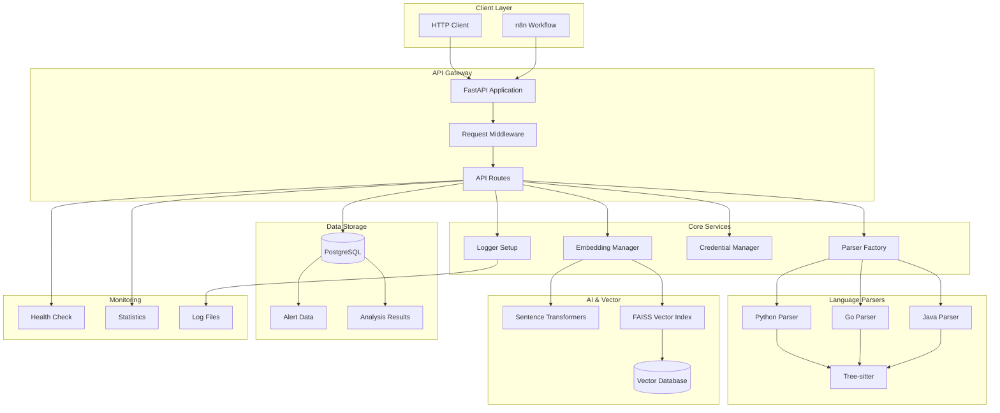

## Data Flow Diagrams

### 1. Code Analysis Flow

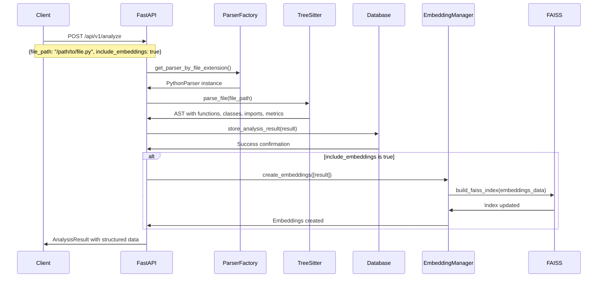

### 2. Semantic Search Flow

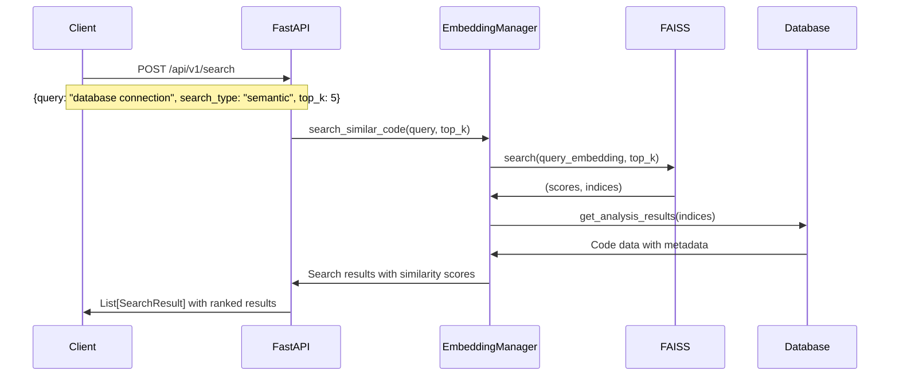

### 3. Alert Analysis Flow

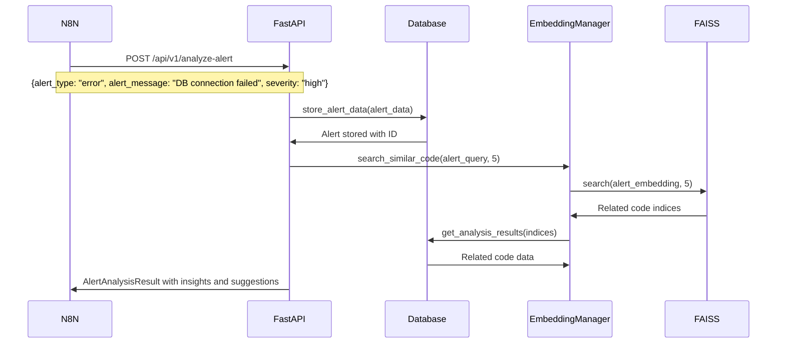

## Component Interactions

### Parser Factory Pattern

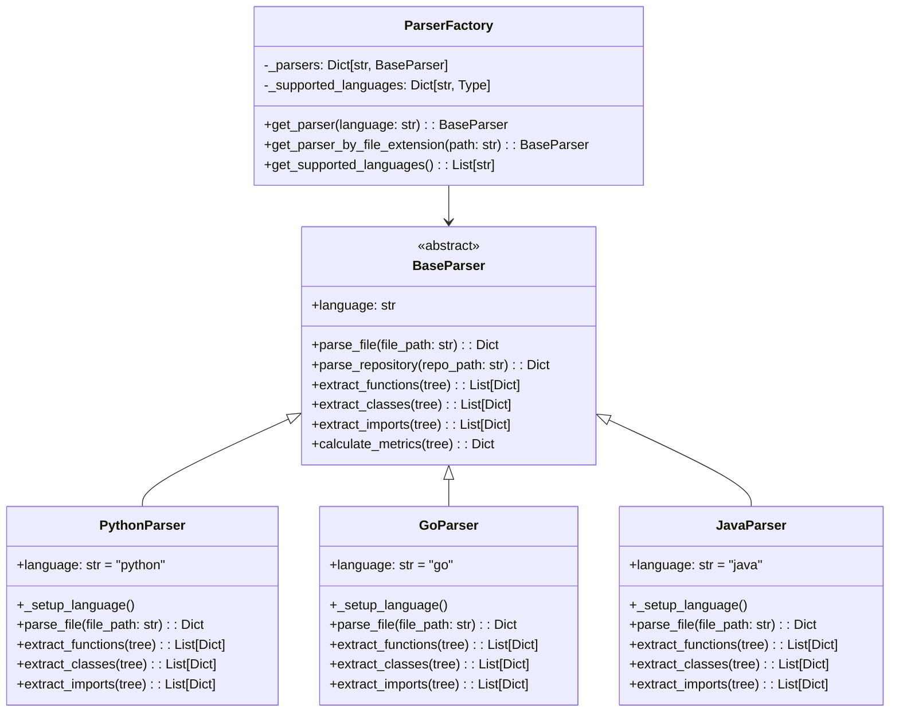

### Database Abstraction Layer

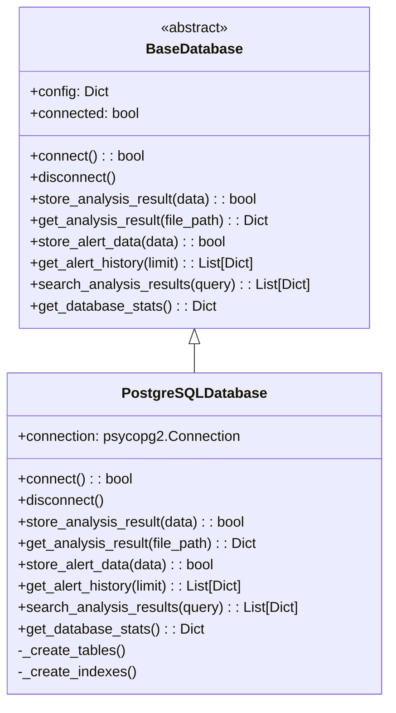

## API Flow

### Request Processing Pipeline

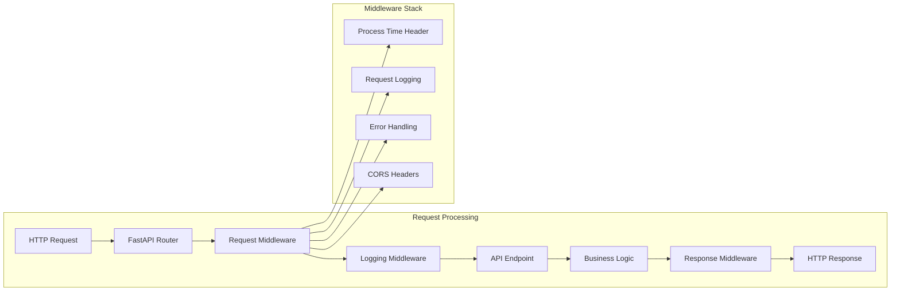

### API Endpoints Flow

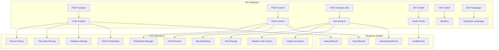

## Database Schema

### Analysis Results Table

```sql
CREATE TABLE analysis_results (
    id SERIAL PRIMARY KEY,
    file_path VARCHAR(500) UNIQUE NOT NULL,
    language VARCHAR(50) NOT NULL,
    functions JSONB,
    classes JSONB,
    imports JSONB,
    metrics JSONB,
    created_at TIMESTAMP DEFAULT CURRENT_TIMESTAMP,
    updated_at TIMESTAMP DEFAULT CURRENT_TIMESTAMP
);

-- Indexes for performance
CREATE INDEX idx_analysis_file_path ON analysis_results(file_path);
CREATE INDEX idx_analysis_language ON analysis_results(language);
CREATE INDEX idx_analysis_created_at ON analysis_results(created_at);
CREATE INDEX idx_analysis_functions ON analysis_results USING GIN(functions);
CREATE INDEX idx_analysis_classes ON analysis_results USING GIN(classes);
```

### Alert Data Table

```sql
CREATE TABLE alert_data (
    id SERIAL PRIMARY KEY,
    alert_type VARCHAR(100) NOT NULL,
    alert_message TEXT NOT NULL,
    file_path VARCHAR(500),
    line_number INTEGER,
    severity VARCHAR(20),
    analysis_result JSONB,
    created_at TIMESTAMP DEFAULT CURRENT_TIMESTAMP
);

-- Indexes for alert queries
CREATE INDEX idx_alert_type ON alert_data(alert_type);
CREATE INDEX idx_alert_severity ON alert_data(severity);
CREATE INDEX idx_alert_created_at ON alert_data(created_at);
CREATE INDEX idx_alert_file_path ON alert_data(file_path);
```

## Vector Search Pipeline

### Embedding Generation Process

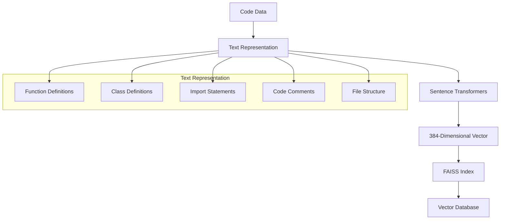

### Search Types

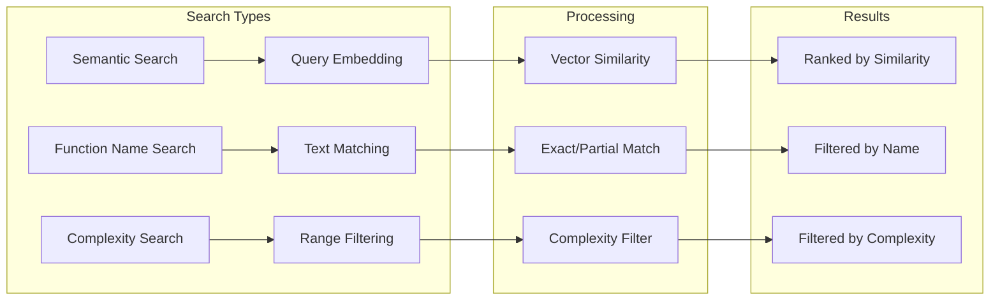

## Monitoring & Logging

### Logging Architecture

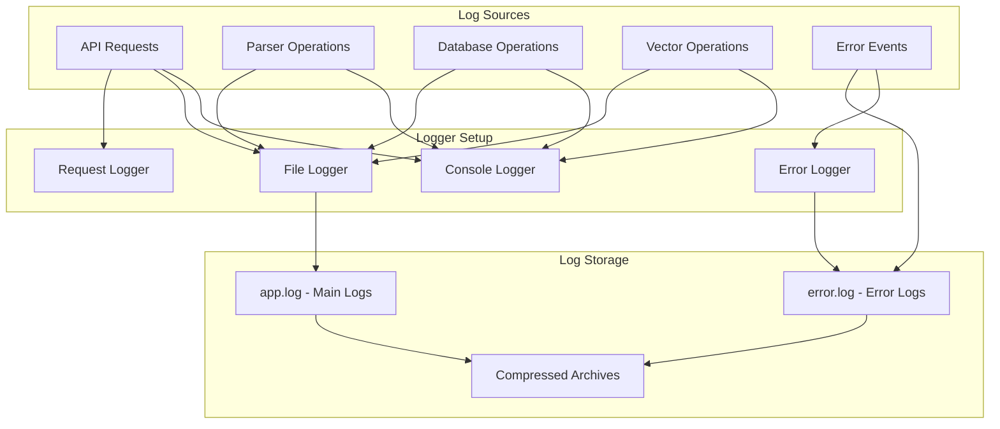

### Health Check Flow

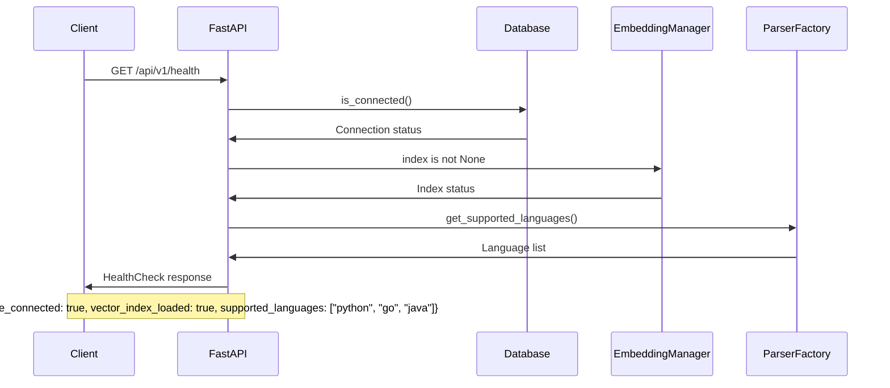

## Deployment Architecture

### Docker Compose Setup

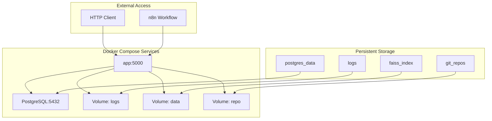

### Production Deployment

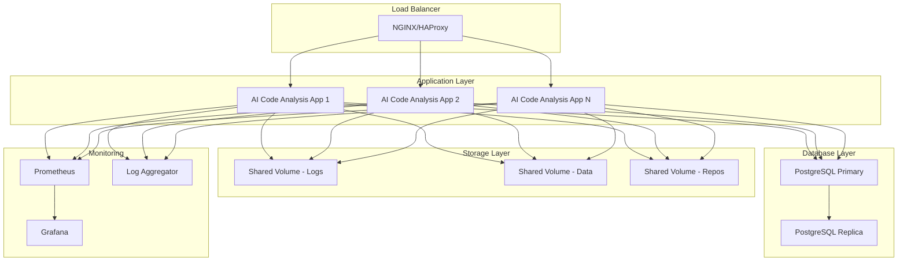

## Performance Considerations

### Caching Strategy

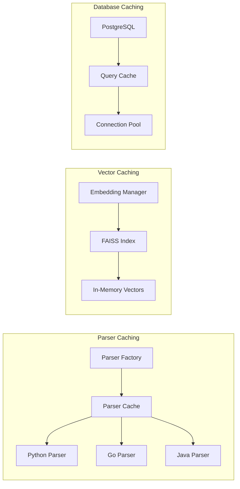

### Scalability Patterns

1. **Horizontal Scaling**: Multiple app instances behind load balancer
2. **Database Scaling**: Read replicas for search operations
3. **Vector Index Scaling**: Sharded FAISS indices for large datasets
4. **Caching**: Redis for frequently accessed data
5. **Async Processing**: Background tasks for heavy operations

## Security Considerations

### Authentication & Authorization

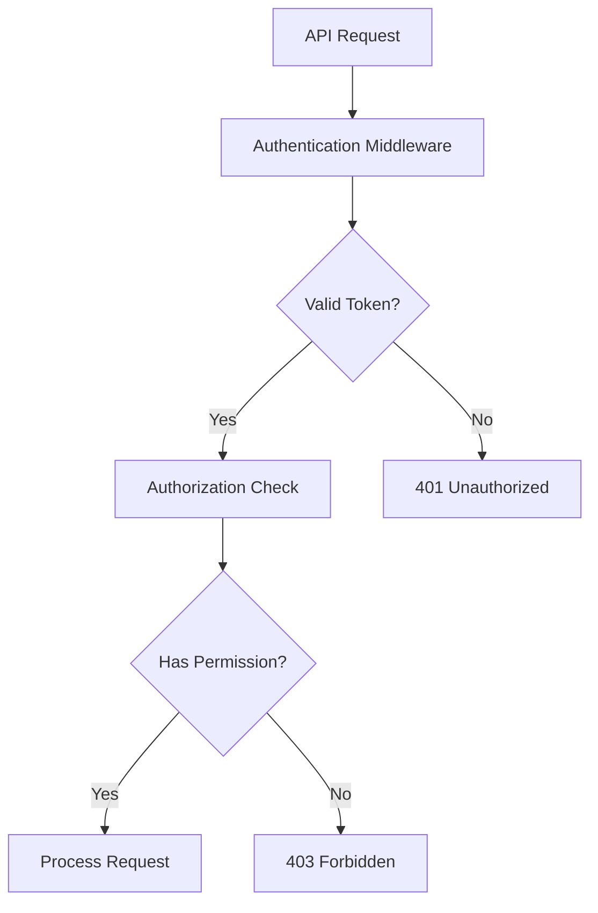

### Data Protection

1. **Environment Variables**: Sensitive data in environment variables
2. **Database Encryption**: Encrypted connections and data at rest
3. **Input Validation**: Pydantic models for request validation
4. **Rate Limiting**: API rate limiting to prevent abuse
5. **Audit Logging**: Comprehensive audit trails

This architecture provides a robust, scalable, and maintainable foundation for AI-powered code analysis with clear separation of concerns and comprehensive monitoring capabilities. 

# Git repository configuration
GIT_REPO_PATH=/app/repo

# Database configuration
DB_TYPE=postgresql
DB_HOST=db
DB_PORT=5432
DB_USER=code_analysis_user
DB_PASSWORD=code_analysis_password
DB_NAME=code_analysis_db

# MongoDB configuration (if using MongoDB instead)
MONGODB_URI=mongodb://localhost:27017/
MONGODB_DB=code_analysis

# API configuration
API_HOST=0.0.0.0
API_PORT=5000
API_DEBUG=False

# Vector database configuration
VECTOR_DIMENSION=384
FAISS_INDEX_PATH=/app/data/faiss_index

# Logging configuration
LOG_LEVEL=INFO
LOG_FILE=/app/logs/app.log

# External API keys (for future AI features)
OPENAI_API_KEY=your_openai_api_key_here
GITHUB_TOKEN=your_github_token_here

# Security (for production)
SECRET_KEY=your_secret_key_here
ALLOWED_ORIGINS=http://localhost:3000,https://yourdomain.com 