# AI Code Analysis Microservice - Flow Diagrams

## Quick Overview Diagrams

### 1. High-Level System Architecture

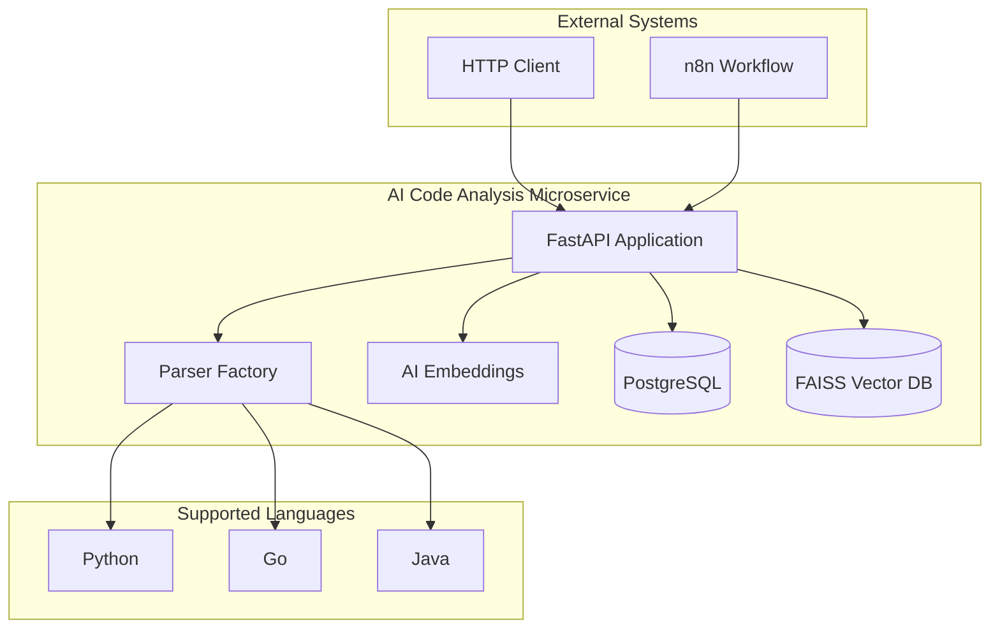

### 2. Main Data Flow - Code Analysis

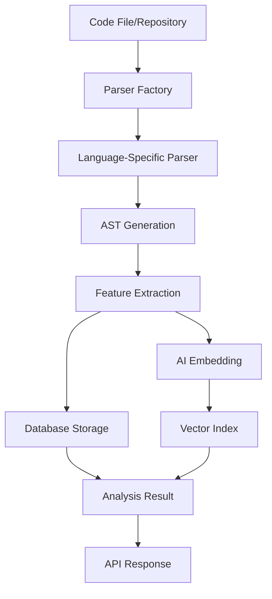

### 3. Search Flow

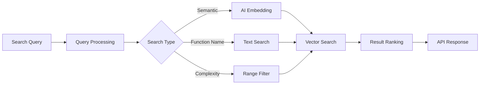

### 4. Alert Analysis Flow

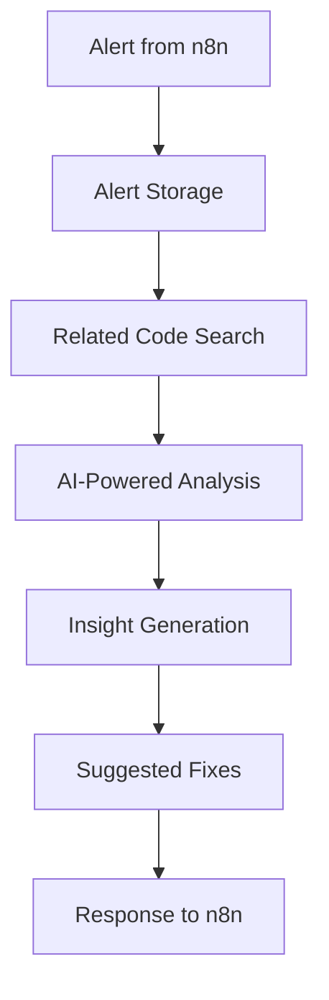

## Detailed Component Flows

### 5. Parser Factory Pattern

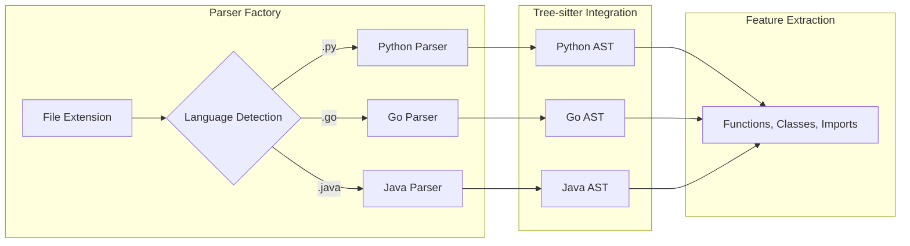

### 6. Vector Search Pipeline

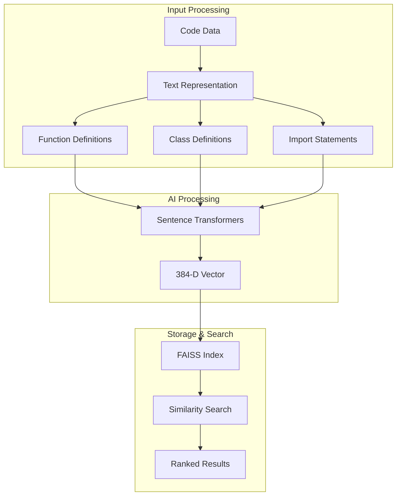

### 7. Database Operations

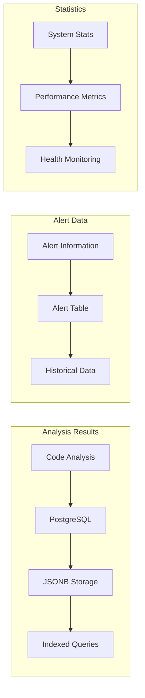

## API Endpoint Flows

### 8. Code Analysis Endpoint

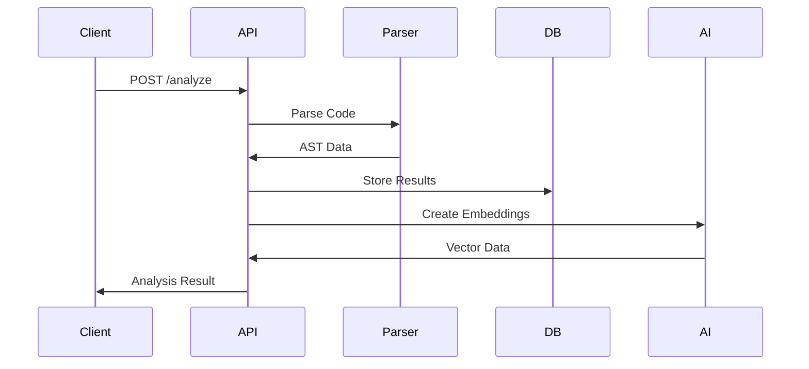

### 9. Search Endpoint

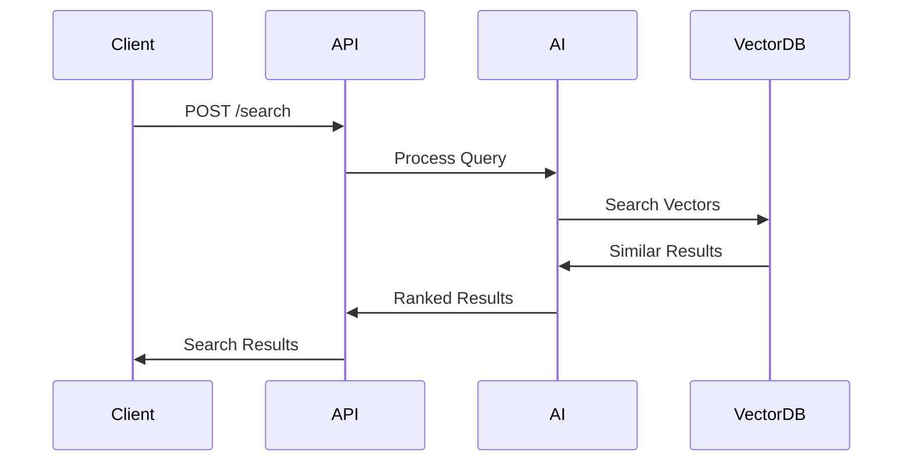

### 10. Alert Analysis Endpoint

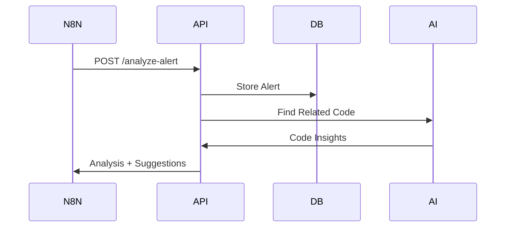

## Deployment Flows

### 11. Docker Deployment

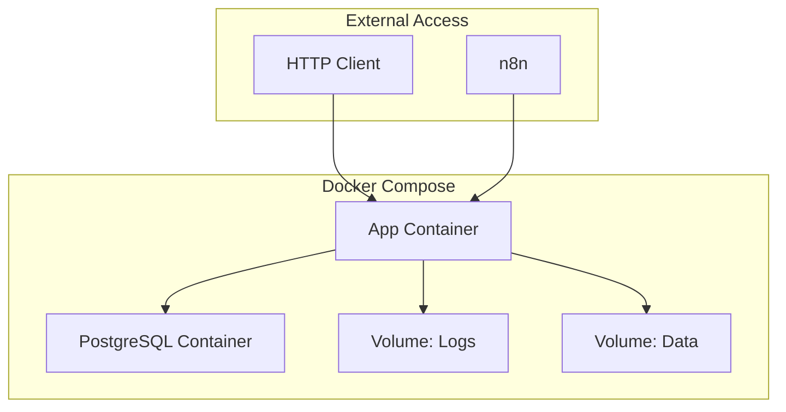

### 12. Production Scaling

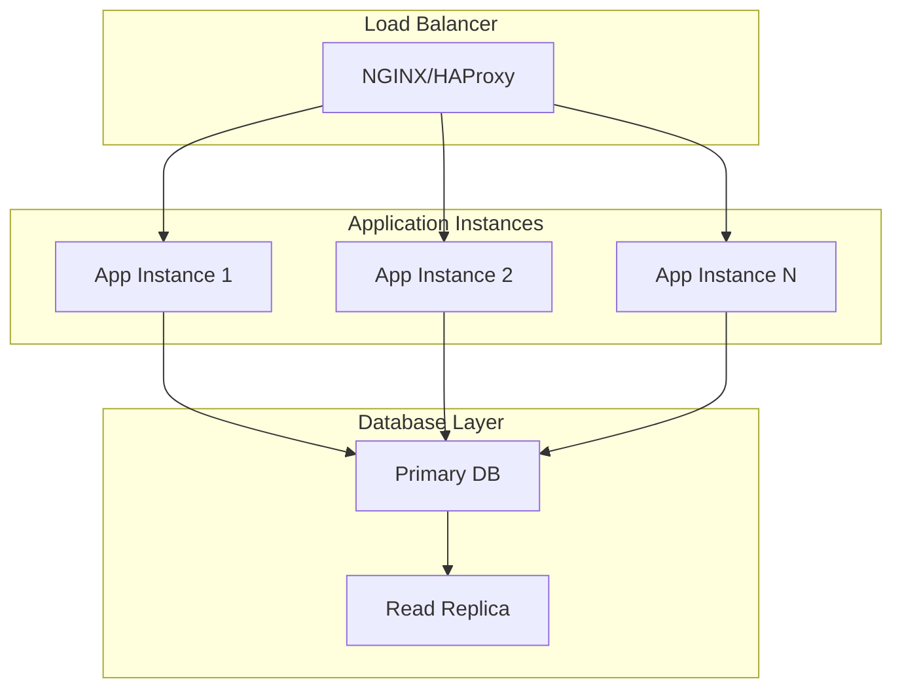

## Monitoring & Health Checks

### 13. Health Check Flow

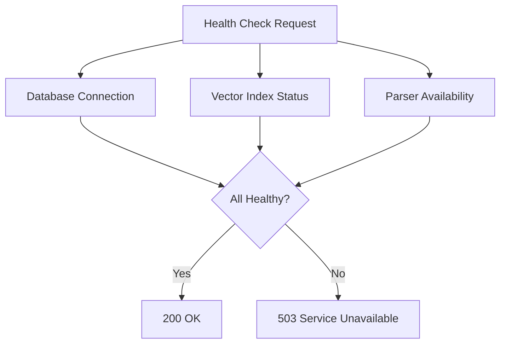

### 14. Logging Flow

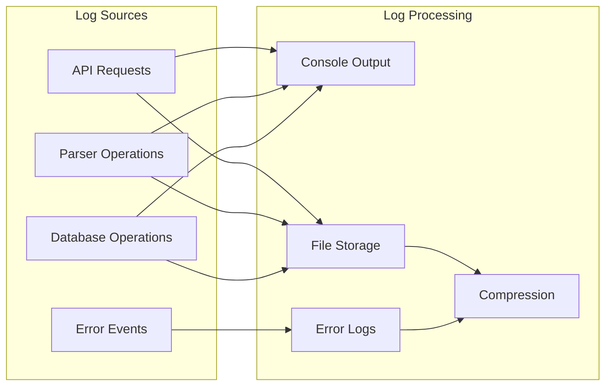

## Integration Flows

### 15. n8n Integration

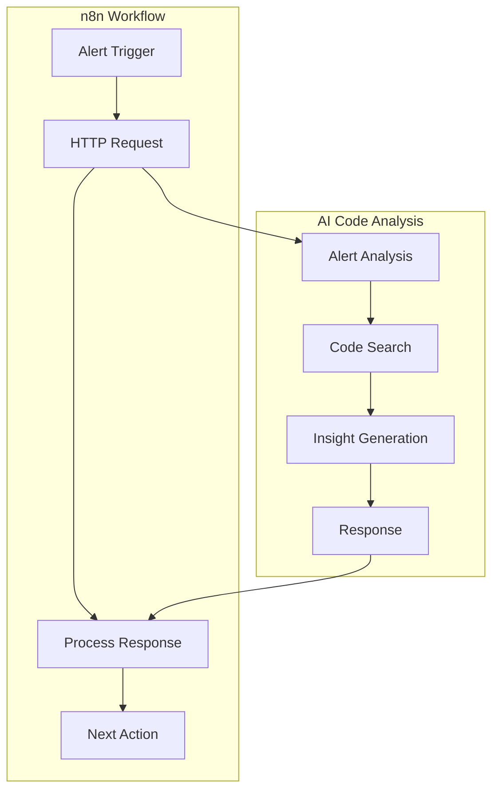

### 16. Multi-Language Support

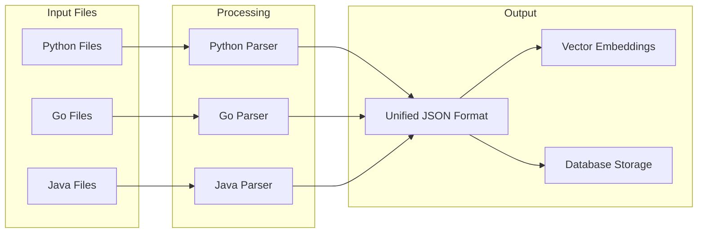

## Performance & Caching

### 17. Caching Strategy

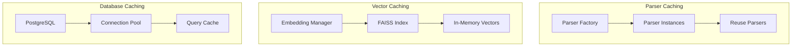

### 18. Scalability Patterns

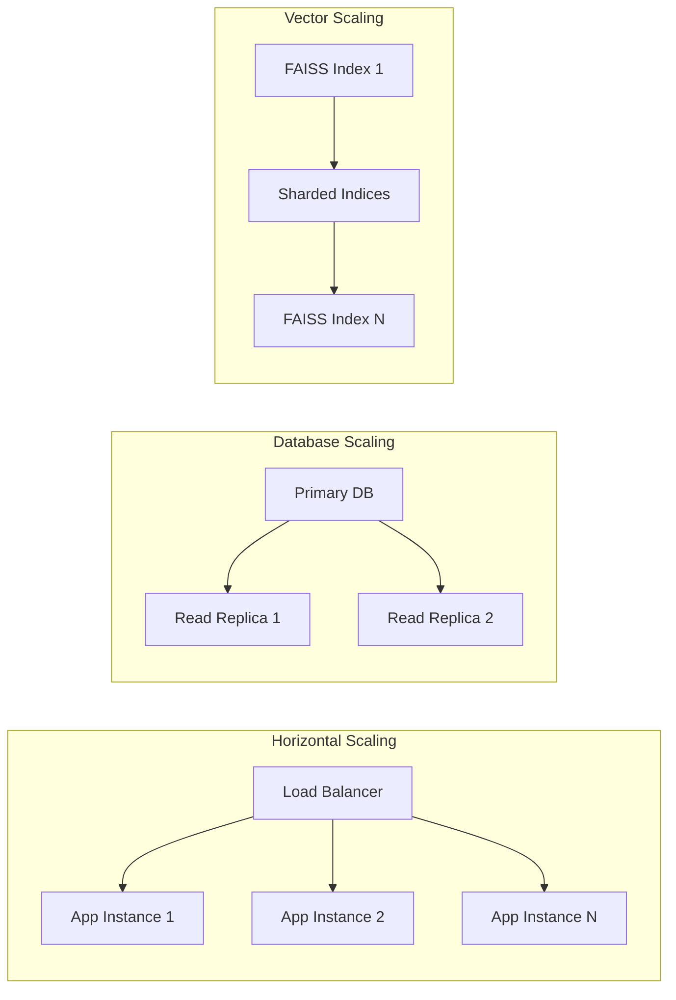

These diagrams provide a comprehensive visual understanding of the AI Code Analysis Microservice architecture and data flows, suitable for both technical and non-technical stakeholders. 