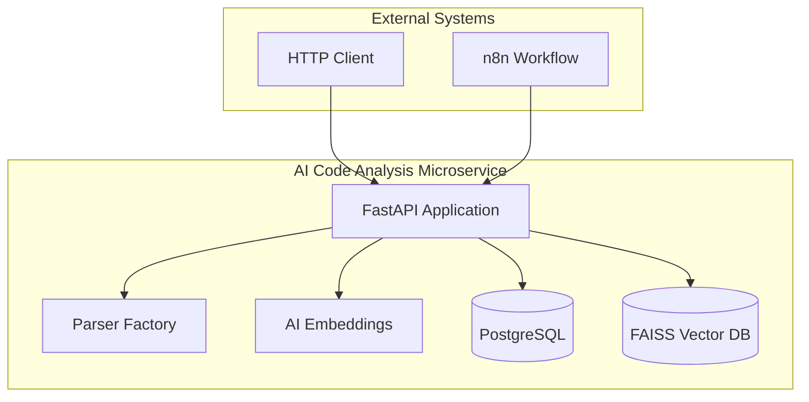
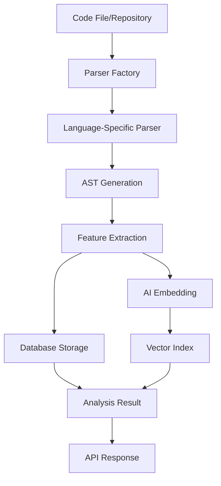

# AI Code Analysis Microservice - Documentation

This directory contains comprehensive documentation for the AI Code Analysis Microservice.

## 📚 Documentation Structure

### Core Documentation
- **[ARCHITECTURE.md](./ARCHITECTURE.md)** - Complete architecture documentation with detailed diagrams
- **[FLOW_DIAGRAMS.md](./FLOW_DIAGRAMS.md)** - Simplified flow diagrams for presentations and quick understanding

### Quick Navigation

#### For Developers
- Start with [ARCHITECTURE.md](./ARCHITECTURE.md) for complete technical understanding
- Review the [Component Interactions](#component-interactions) section for design patterns
- Check [Database Schema](#database-schema) for data models

#### For Stakeholders
- Begin with [FLOW_DIAGRAMS.md](./FLOW_DIAGRAMS.md) for high-level understanding
- Review the [High-Level System Architecture](#1-high-level-system-architecture) diagram
- Check [Main Data Flow](#2-main-data-flow---code-analysis) for process understanding

#### For Operations
- Review [Deployment Architecture](#deployment-architecture) in ARCHITECTURE.md
- Check [Monitoring & Logging](#monitoring--logging) sections
- Review [Health Check Flow](#health-check-flow) for monitoring setup

## 🎯 Key Diagrams Overview

### System Architecture

### Main Data Flow

## 📖 Documentation Sections

### Architecture Documentation ([ARCHITECTURE.md](./ARCHITECTURE.md))

1. **System Overview** - High-level system description and key features
2. **Architecture Diagram** - Complete system architecture with all components
3. **Data Flow Diagrams** - Detailed sequence diagrams for main operations
4. **Component Interactions** - Class diagrams and design patterns
5. **API Flow** - Request processing pipeline and endpoint flows
6. **Database Schema** - Complete database structure and indexes
7. **Vector Search Pipeline** - AI embedding and search processes
8. **Monitoring & Logging** - Logging architecture and health checks
9. **Deployment Architecture** - Docker and production deployment
10. **Performance Considerations** - Caching and scalability patterns
11. **Security Considerations** - Authentication and data protection

### Flow Diagrams ([FLOW_DIAGRAMS.md](./FLOW_DIAGRAMS.md))

1. **Quick Overview Diagrams** - High-level system understanding
2. **Detailed Component Flows** - Specific component interactions
3. **API Endpoint Flows** - Request/response sequences
4. **Deployment Flows** - Container and production deployment
5. **Monitoring & Health Checks** - System monitoring flows
6. **Integration Flows** - External system integrations
7. **Performance & Caching** - Optimization strategies

## 🔍 How to Use These Diagrams

### For Development
- Use the detailed architecture diagrams to understand component relationships
- Reference the sequence diagrams for implementing new features
- Check the database schema for data modeling decisions

### For Presentations
- Use the simplified flow diagrams for stakeholder presentations
- Focus on the high-level system architecture for overview
- Use the main data flow diagram to explain the core process

### For Operations
- Reference the deployment diagrams for infrastructure setup
- Use the monitoring diagrams for observability configuration
- Check the health check flows for monitoring implementation

## 🛠️ Diagram Tools

These diagrams are written in **Mermaid** syntax and can be rendered in:
- GitHub (native support)
- GitLab (native support)
- VS Code (with Mermaid extension)
- Online Mermaid editor: https://mermaid.live/
- Documentation generators (Sphinx, Docusaurus, etc.)

## 📝 Contributing to Documentation

When adding new features or components:

1. **Update Architecture Diagrams** - Add new components to the main architecture diagram
2. **Add Flow Diagrams** - Create sequence diagrams for new API endpoints
3. **Update Database Schema** - Document new tables or schema changes
4. **Add Component Interactions** - Document new design patterns or classes

### Diagram Guidelines

- Keep diagrams focused on a single concept or flow
- Use consistent naming conventions
- Include both high-level and detailed views
- Add notes to explain complex interactions
- Use color coding for different types of components

## 🔗 Related Documentation

- **[../README.md](../README.md)** - Main project README with setup instructions
- **[../Makefile](../Makefile)** - Development and deployment commands
- **[../scripts/setup.py](../scripts/setup.py)** - Project setup script
- **[../docker-compose.yml](../docker-compose.yml)** - Container configuration

## 📞 Support

For questions about the architecture or flow diagrams:
1. Check the detailed documentation in [ARCHITECTURE.md](./ARCHITECTURE.md)
2. Review the simplified flows in [FLOW_DIAGRAMS.md](./FLOW_DIAGRAMS.md)
3. Refer to the main project README for implementation details 